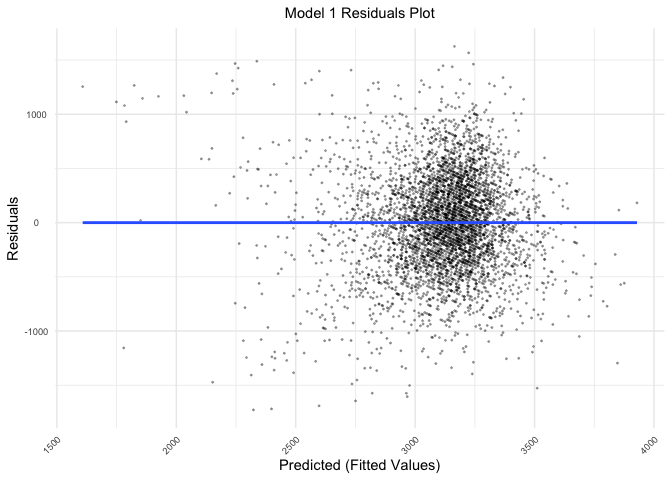

p8105_hw6_sjz2120
================
Sophie Zhang (sjz2120)
2022-11-22

# Problem 1

For this problem, we’ll use the 2017 Central Park weather data that
we’ve seen elsewhere. The code chunk below (adapted from the course
website) will download these data.

The boostrap is helpful when you’d like to perform inference for a
parameter / value / summary that doesn’t have an easy-to-write-down
distribution in the usual repeated sampling framework. We’ll focus on a
simple linear regression with tmax as the response and tmin as the
predictor, and are interested in the distribution of two quantities
estimated from these data:

- r̂ 2
- log(β̂ 0∗β̂ 1

Use 5000 bootstrap samples and, for each bootstrap sample, produce
estimates of these two quantities. Plot the distribution of your
estimates, and describe these in words. Using the 5000 bootstrap
estimates, identify the 2.5% and 97.5% quantiles to provide a 95%
confidence interval for r̂ 2 and log(β̂ 0∗β̂ 1). Note: broom::glance() is
helpful for extracting r̂ 2 from a fitted regression, and broom::tidy()
(with some additional wrangling) should help in computing log(β̂ 0∗β̂ 1).

# Problem 2

The Washington Post has gathered data on homicides in 50 large U.S.
cities and made the data available through a GitHub repository. Let’s
load in the raw dataset:

``` r
wp_homicides_url = "https://raw.githubusercontent.com/washingtonpost/data-homicides/master/homicide-data.csv"

homicides =
  read_csv(wp_homicides_url,
           col_types = c("c", "c", "c", "c", "c", "n", "c", "c", "c", "d", "d", "c")) %>% # Read in the raw csv dataset
  janitor::clean_names()

homicides
```

    ## # A tibble: 52,179 × 12
    ##    uid   repor…¹ victi…² victi…³ victi…⁴ victi…⁵ victi…⁶ city  state   lat   lon
    ##    <chr>   <dbl> <chr>   <chr>   <chr>   <chr>   <chr>   <chr> <chr> <dbl> <dbl>
    ##  1 Alb-…  2.01e7 GARCIA  JUAN    Hispan… 78      Male    Albu… NM     35.1 -107.
    ##  2 Alb-…  2.01e7 MONTOYA CAMERON Hispan… 17      Male    Albu… NM     35.1 -107.
    ##  3 Alb-…  2.01e7 SATTER… VIVIANA White   15      Female  Albu… NM     35.1 -107.
    ##  4 Alb-…  2.01e7 MENDIO… CARLOS  Hispan… 32      Male    Albu… NM     35.1 -107.
    ##  5 Alb-…  2.01e7 MULA    VIVIAN  White   72      Female  Albu… NM     35.1 -107.
    ##  6 Alb-…  2.01e7 BOOK    GERALD… White   91      Female  Albu… NM     35.2 -107.
    ##  7 Alb-…  2.01e7 MALDON… DAVID   Hispan… 52      Male    Albu… NM     35.1 -107.
    ##  8 Alb-…  2.01e7 MALDON… CONNIE  Hispan… 52      Female  Albu… NM     35.1 -107.
    ##  9 Alb-…  2.01e7 MARTIN… GUSTAVO White   56      Male    Albu… NM     35.1 -107.
    ## 10 Alb-…  2.01e7 HERRERA ISRAEL  Hispan… 43      Male    Albu… NM     35.1 -107.
    ## # … with 52,169 more rows, 1 more variable: disposition <chr>, and abbreviated
    ## #   variable names ¹​reported_date, ²​victim_last, ³​victim_first, ⁴​victim_race,
    ## #   ⁵​victim_age, ⁶​victim_sex

### Cleaning the `homicides` dataset

Now let’s clean the `homicides` dataset. Below, I’ve created a
`city_state` variable (combining the `city` and `state` variables), and
a binary variable `solved` indicating whether the homicide is solved.
Additionally, I’ve omitted the cities of Dallas, TX; Phoenix, AZ; and
Kansas City, MO, because they don’t report victim race. I’ve also
omitted Tulsa, AL since it’s a data entry mistake.

For this problem, I’ve limited my analysis to those for whom victim_race
is white or Black.

``` r
homicides_df =
  homicides %>%
  mutate(city_state = paste(city, state, sep = ", "),  # Create `city_state` and `solved` variables
         solved = ifelse(disposition %in% c("Closed by arrest", "Closed without arrest"), 1, 0)) %>%
  filter(!(city_state %in% c("Dallas, TX",
                             "Phoenix, AZ",
                             "Kansas City, MO",
                             "Tulsa, AL")), # Omit cities
         victim_race %in% c("White", "Black")) %>% # Limit analyses
  mutate(victim_age = as.numeric(victim_age),
         reported_date = as.character(reported_date),
         reported_date = as.Date(reported_date, "%Y%m%d")) %>% # Change variable types
  select(victim_race, victim_age, victim_sex, city_state, solved)
```

    ## Warning in mask$eval_all_mutate(quo): NAs introduced by coercion

``` r
homicides_df
```

    ## # A tibble: 39,693 × 5
    ##    victim_race victim_age victim_sex city_state      solved
    ##    <chr>            <dbl> <chr>      <chr>            <dbl>
    ##  1 White               15 Female     Albuquerque, NM      1
    ##  2 White               72 Female     Albuquerque, NM      1
    ##  3 White               91 Female     Albuquerque, NM      0
    ##  4 White               56 Male       Albuquerque, NM      0
    ##  5 White               NA Male       Albuquerque, NM      1
    ##  6 White               43 Female     Albuquerque, NM      1
    ##  7 White               52 Male       Albuquerque, NM      1
    ##  8 White               22 Female     Albuquerque, NM      1
    ##  9 Black               15 Male       Albuquerque, NM      1
    ## 10 Black               25 Male       Albuquerque, NM      1
    ## # … with 39,683 more rows

The cleaned and limited `homicides_df` dataset contains 39693
rows/observations and 5 columns/variables. Each of the 39693 rows
represents a homicide. The 5 key variables in this dataset include:
victim_race, victim_age, victim_sex, city_state, solved:

- Demographic information for each homicide victim, including their race
  (`victim_race`), age (`victim_age`), sex (`victim_sex`)
- `city_state` – combines the `city` and `state` variables
- `solved` – indicates whether the homicide is solved (1 if solved, 0 if
  unsolved)

### Solving Homicides in Baltimore, MD

For the city of Baltimore, MD, I used the GLM function to fit a logistic
regression with resolved vs unresolved homicides (as the outcome) and
victim age, sex, and race as predictors. The GLM output has been saved
as `baltimore_glm`, and has been tidied. Additionally, I’ve created
columns in `baltimore_glm` for the estimate and confidence interval of
the adjusted odds ratio for solving homicides comparing male victims to
female victims, keeping all other variables fixed.

``` r
# Creating a dataframe with only Baltimore, MD homicides data
baltimore_df =
  homicides_df %>%
  filter(city_state == "Baltimore, MD")

# Let's run a GLM on solved vs unsolved homicides in Baltimore, MD, calculate the OR and CI estimates, and save it as an R object `baltimore_glm`
baltimore_glm =
  baltimore_df %>%
  glm(solved ~ victim_age + victim_sex + victim_race,
    data = .,
    family = binomial()) %>%
  broom::tidy() %>%
  janitor::clean_names() %>%
  mutate(OR = exp(estimate),
         CI_lower = exp(estimate - 1.96*std_error),
         CI_upper = exp(estimate + 1.96*std_error))

baltimore_glm
```

    ## # A tibble: 4 × 8
    ##   term             estimate std_error statistic  p_value    OR CI_lower CI_upper
    ##   <chr>               <dbl>     <dbl>     <dbl>    <dbl> <dbl>    <dbl>    <dbl>
    ## 1 (Intercept)       0.664     0.174        3.80 1.42e- 4 1.94     1.38     2.73 
    ## 2 victim_age       -0.00520   0.00325     -1.60 1.10e- 1 0.995    0.988    1.00 
    ## 3 victim_sexMale   -1.04      0.143       -7.26 3.74e-13 0.355    0.268    0.469
    ## 4 victim_raceWhite  0.900     0.180        4.99 6.04e- 7 2.46     1.73     3.50

### Solving homicides in each city

Below, I’ve run a GLM for each of the cities in the `homicides_df`
dataset and saved the output as `homicides_glm_df`. Like the previous
section, I’ve additionally extract the adjusted odds ratio (and CI) for
solving homicides comparing male victims to female victims.

``` r
homicides_glm_df =
  homicides_df %>%
  nest(data = -city_state) %>%
  mutate(glm_cities = map(.x = data, ~glm(solved ~ victim_age + victim_sex + victim_race, data = .x, family = binomial())),
         glm_tidy = map(glm_cities, broom::tidy)) %>%
  select(city_state, glm_tidy) %>%
  unnest(glm_tidy) %>%
  mutate(OR = exp(estimate),
         CI_lower = exp(estimate - 1.96*std.error),
         CI_upper = exp(estimate + 1.96*std.error)) %>%
  select(city_state, term, OR, CI_lower, CI_upper)
  
homicides_glm_df
```

    ## # A tibble: 193 × 5
    ##    city_state      term                      OR CI_lower CI_upper
    ##    <chr>           <chr>                  <dbl>    <dbl>    <dbl>
    ##  1 Albuquerque, NM (Intercept)            8.45     1.68    42.5  
    ##  2 Albuquerque, NM victim_age             0.986    0.965    1.01 
    ##  3 Albuquerque, NM victim_sexMale         0.430    0.148    1.25 
    ##  4 Albuquerque, NM victim_sexUnknown 383546.       0      Inf    
    ##  5 Albuquerque, NM victim_raceWhite       1.65     0.688    3.98 
    ##  6 Atlanta, GA     (Intercept)            5.57     3.23     9.59 
    ##  7 Atlanta, GA     victim_age             0.989    0.979    0.998
    ##  8 Atlanta, GA     victim_sexMale         0.512    0.328    0.799
    ##  9 Atlanta, GA     victim_raceWhite       1.23     0.681    2.22 
    ## 10 Baltimore, MD   (Intercept)            1.94     1.38     2.73 
    ## # … with 183 more rows

### Plot visualizing solving homicides for each city

Below, I’ve created a plot called `homicides_mvf_plot` that shows the
estimated ORs and CIs for solving homicides comparing male victims to
female victims in each city. The cities are organized according to
estimated OR.

``` r
homicides_mvf_plot =
  homicides_glm_df %>%
  filter(term == "victim_sexMale") %>% 
  mutate(city_state = fct_reorder(city_state, OR)) %>%
  ggplot(aes(x = city_state, y = OR)) +
  geom_point(alpha = 0.5) +
  geom_errorbar(aes(ymin = CI_lower, ymax = CI_upper),
                alpha = 0.5) +
  labs(title = "Estimated odds ratios & 95% confidence intervals of solved homicides, by city",
        subtitle = "ORs comparing male vs female homicide victims",
        x = "City (City, State)",
        y = "Estimated ORs for solved homicides, male vs female (w/95% CI)") +
  theme(plot.title = element_text(size = 11, hjust = 0.5),
        plot.subtitle = element_text(size = 10, hjust = 0.5),
        axis.text.x = element_text(size = 7, angle = 45, hjust = 1),
        axis.text.y = element_text(size = 7, hjust = 0.5),
        legend.position = "none")
```

\[\]

\<\>

# Problem 3

In this problem, you will analyze data gathered to understand the
effects of several variables on a child’s birthweight. This dataset,
available here, consists of roughly 4000 children and includes the
following variables:

### Loading and cleaning the `birthweight_df` dataset

Load and clean the data for regression analysis (i.e. convert numeric to
factor where appropriate, check for missing data, etc.).

``` r
# Let's load in the dataset!
birthweight_df =
  read_csv("data/birthweight.csv") %>%
  janitor::clean_names() %>%
  mutate(babysex = as.factor(babysex),
         frace = as.factor(frace),
         malform = as.factor(malform),
         mrace = as.factor(mrace))

birthweight_df
```

    ## # A tibble: 4,342 × 20
    ##    babysex bhead blength   bwt delwt fincome frace gaweeks malform menarche
    ##    <fct>   <dbl>   <dbl> <dbl> <dbl>   <dbl> <fct>   <dbl> <fct>      <dbl>
    ##  1 2          34      51  3629   177      35 1        39.9 0             13
    ##  2 1          34      48  3062   156      65 2        25.9 0             14
    ##  3 2          36      50  3345   148      85 1        39.9 0             12
    ##  4 1          34      52  3062   157      55 1        40   0             14
    ##  5 2          34      52  3374   156       5 1        41.6 0             13
    ##  6 1          33      52  3374   129      55 1        40.7 0             12
    ##  7 2          33      46  2523   126      96 2        40.3 0             14
    ##  8 2          33      49  2778   140       5 1        37.4 0             12
    ##  9 1          36      52  3515   146      85 1        40.3 0             11
    ## 10 1          33      50  3459   169      75 2        40.7 0             12
    ## # … with 4,332 more rows, and 10 more variables: mheight <dbl>, momage <dbl>,
    ## #   mrace <fct>, parity <dbl>, pnumlbw <dbl>, pnumsga <dbl>, ppbmi <dbl>,
    ## #   ppwt <dbl>, smoken <dbl>, wtgain <dbl>

Now let’s check for missing data in `birthweight_df`! There seems to be
0 missing data for all of the variables in the dataframe:)

``` r
# Let's check for missing data:
map(birthweight_df, ~sum(is.na(.)))
```

    ## $babysex
    ## [1] 0
    ## 
    ## $bhead
    ## [1] 0
    ## 
    ## $blength
    ## [1] 0
    ## 
    ## $bwt
    ## [1] 0
    ## 
    ## $delwt
    ## [1] 0
    ## 
    ## $fincome
    ## [1] 0
    ## 
    ## $frace
    ## [1] 0
    ## 
    ## $gaweeks
    ## [1] 0
    ## 
    ## $malform
    ## [1] 0
    ## 
    ## $menarche
    ## [1] 0
    ## 
    ## $mheight
    ## [1] 0
    ## 
    ## $momage
    ## [1] 0
    ## 
    ## $mrace
    ## [1] 0
    ## 
    ## $parity
    ## [1] 0
    ## 
    ## $pnumlbw
    ## [1] 0
    ## 
    ## $pnumsga
    ## [1] 0
    ## 
    ## $ppbmi
    ## [1] 0
    ## 
    ## $ppwt
    ## [1] 0
    ## 
    ## $smoken
    ## [1] 0
    ## 
    ## $wtgain
    ## [1] 0

### Describing the `birthweight_df` dataset

The cleaned `birthweight_df` dataset contains 4342 rows/observations and
20 columns/variables. After a quick check, we also see that the dataset
has no missing data (see above). Each of the 4342 rows represents a
birth The 20 key variables in this dataset include: babysex, bhead,
blength, bwt, delwt, fincome, frace, gaweeks, malform, menarche,
mheight, momage, mrace, parity, pnumlbw, pnumsga, ppbmi, ppwt, smoken,
wtgain:

- `babysex`: baby’s sex (male = 1, female = 2)
- `bhead`: baby’s head circumference at birth (centimeters)
- `blength`: baby’s length at birth (centimeteres)
- `bwt`: baby’s birth weight (grams)
- `delwt`: mother’s weight at delivery (pounds)
- `fincome`: family monthly income (in hundreds, rounded)
- `frace`: father’s race (1 = White, 2 = Black, 3 = Asian, 4 = Puerto
  Rican, 8 = Other, 9 = Unknown)
- `gaweeks`: gestational age in weeks
- `malform`: presence of malformations that could affect weight (0 =
  absent, 1 = present)
- `menarche`: mother’s age at menarche (years)
- `mheigth`: mother’s height (inches)
- `momage`: mother’s age at delivery (years)
- `mrace`: mother’s race (1 = White, 2 = Black, 3 = Asian, 4 = Puerto
  Rican, 8 = Other)
- `parity`: number of live births prior to this pregnancy
- `pnumlbw`: previous number of low birth weight babies
- `pnumgsa`: number of prior small for gestational age babies
- `ppbmi`: mother’s pre-pregnancy BMI
- `ppwt`: mother’s pre-pregnancy weight (pounds)
- `smoken`: average number of cigarettes smoked per day during pregnancy
- `wtgain`: mother’s weight gain during pregnancy (pounds)

### Let’s make a regression model for birthweight!

Propose a regression model for birthweight. This model may be based on a
hypothesized structure for the factors that underly birthweight, on a
data-driven model-building process, or a combination of the two.
Describe your modeling process.

``` r
# Model 1: Monthly income, gestational age, mother's age at delivery, number of live births prior to this pregnancy, number of prior small for gestational age babies, mother's pre-pregnancy BMI
model_1 = lm(bwt ~ gaweeks + momage + parity + ppbmi, data = birthweight_df)
model_1
```

    ## 
    ## Call:
    ## lm(formula = bwt ~ gaweeks + momage + parity + ppbmi, data = birthweight_df)
    ## 
    ## Coefficients:
    ## (Intercept)      gaweeks       momage       parity        ppbmi  
    ##       52.52        65.31        10.92        98.65        12.29

Show a plot of model residuals against fitted values – use
add_predictions and add_residuals from the modelr package in making this
plot.

``` r
residual_plot =
  birthweight_df %>%
  add_predictions(model_1) %>%
  add_residuals(model_1) %>%
  ggplot(aes(x = pred, y = resid)) +
  geom_point(alpha = 0.3, size = 0.3) +
  geom_smooth(se = FALSE, method = "lm") +
  labs(title = "Model 1 Residuals Plot",
      x = "Predicted (Fitted Values)",
      y = "Residuals") +
  theme(plot.title = element_text(size = 11, hjust = 0.5),
        plot.subtitle = element_text(size = 10, hjust = 0.5),
        axis.text.x = element_text(size = 7, angle = 45, hjust = 1),
        axis.text.y = element_text(size = 7, hjust = 0.5),
        legend.position = "none")

residual_plot
```

    ## `geom_smooth()` using formula 'y ~ x'

<!-- -->

### Creating more regression models for birthweight

Compare your model to two others:

One using length at birth and gestational age as predictors (main
effects only) One using head circumference, length, sex, and all
interactions (including the three-way interaction) between these

``` r
# Model 2: Length at birth and gestational age as predictors (main effects only)
model_2 = lm(bwt ~ blength + gaweeks, data = birthweight_df)

# Model 3: Head circumference, length, sex, and all interactions (including the three-way interaction)
model_3 = lm(bwt ~ bhead + blength + babysex + bhead*blength + bhead*babysex + blength*babysex + bhead*blength*babysex, data = birthweight_df)

model_2
```

    ## 
    ## Call:
    ## lm(formula = bwt ~ blength + gaweeks, data = birthweight_df)
    ## 
    ## Coefficients:
    ## (Intercept)      blength      gaweeks  
    ##    -4347.67       128.56        27.05

``` r
model_3
```

    ## 
    ## Call:
    ## lm(formula = bwt ~ bhead + blength + babysex + bhead * blength + 
    ##     bhead * babysex + blength * babysex + bhead * blength * babysex, 
    ##     data = birthweight_df)
    ## 
    ## Coefficients:
    ##            (Intercept)                   bhead                 blength  
    ##             -7176.8170                181.7956                102.1269  
    ##               babysex2           bhead:blength          bhead:babysex2  
    ##              6374.8684                 -0.5536               -198.3932  
    ##       blength:babysex2  bhead:blength:babysex2  
    ##              -123.7729                  3.8781

### Cross validation of our regression models

Let’s compare model 1 to these models 2 and 3! Make this comparison in
terms of the cross-validated prediction error; use crossv_mc and
functions in purrr as appropriate. Note that although we expect your
model to be reasonable, model building itself is not a main idea of the
course and we don’t necessarily expect your model to be “optimal”.
