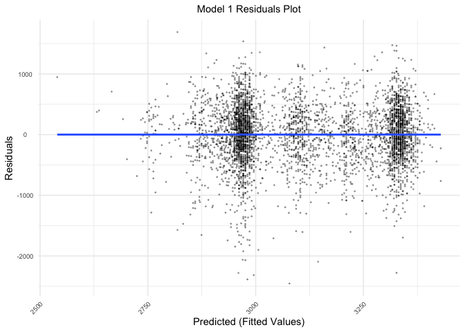
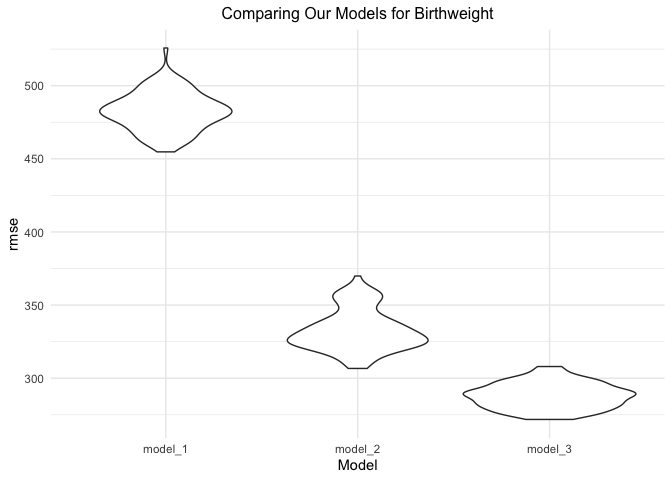

p8105_hw6_sjz2120
================
Sophie Zhang (sjz2120)
2022-11-22

# Problem 1

For this problem, we’ll use the 2017 Central Park weather data that
we’ve seen elsewhere. The code chunk below (adapted from the course
website) will download these data.

The boostrap is helpful when you’d like to perform inference for a
parameter / value / summary that doesn’t have an easy-to-write-down
distribution in the usual repeated sampling framework. We’ll focus on a
simple linear regression with tmax as the response and tmin as the
predictor, and are interested in the distribution of two quantities
estimated from these data:

- r̂ 2
- log(β̂ 0∗β̂ 1

Use 5000 bootstrap samples and, for each bootstrap sample, produce
estimates of these two quantities. Plot the distribution of your
estimates, and describe these in words. Using the 5000 bootstrap
estimates, identify the 2.5% and 97.5% quantiles to provide a 95%
confidence interval for r̂ 2 and log(β̂ 0∗β̂ 1). Note: broom::glance() is
helpful for extracting r̂ 2 from a fitted regression, and broom::tidy()
(with some additional wrangling) should help in computing log(β̂ 0∗β̂ 1).

# Problem 2

The Washington Post has gathered data on homicides in 50 large U.S.
cities and made the data available through a GitHub repository. Let’s
load in the raw dataset:

``` r
wp_homicides_url = "https://raw.githubusercontent.com/washingtonpost/data-homicides/master/homicide-data.csv"

homicides =
  read_csv(wp_homicides_url,
           col_types = c("c", "c", "c", "c", "c", "n", "c", "c", "c", "d", "d", "c")) %>% # Read in the raw csv dataset
  janitor::clean_names()

homicides
```

    ## # A tibble: 52,179 × 12
    ##    uid   repor…¹ victi…² victi…³ victi…⁴ victi…⁵ victi…⁶ city  state   lat   lon
    ##    <chr>   <dbl> <chr>   <chr>   <chr>   <chr>   <chr>   <chr> <chr> <dbl> <dbl>
    ##  1 Alb-…  2.01e7 GARCIA  JUAN    Hispan… 78      Male    Albu… NM     35.1 -107.
    ##  2 Alb-…  2.01e7 MONTOYA CAMERON Hispan… 17      Male    Albu… NM     35.1 -107.
    ##  3 Alb-…  2.01e7 SATTER… VIVIANA White   15      Female  Albu… NM     35.1 -107.
    ##  4 Alb-…  2.01e7 MENDIO… CARLOS  Hispan… 32      Male    Albu… NM     35.1 -107.
    ##  5 Alb-…  2.01e7 MULA    VIVIAN  White   72      Female  Albu… NM     35.1 -107.
    ##  6 Alb-…  2.01e7 BOOK    GERALD… White   91      Female  Albu… NM     35.2 -107.
    ##  7 Alb-…  2.01e7 MALDON… DAVID   Hispan… 52      Male    Albu… NM     35.1 -107.
    ##  8 Alb-…  2.01e7 MALDON… CONNIE  Hispan… 52      Female  Albu… NM     35.1 -107.
    ##  9 Alb-…  2.01e7 MARTIN… GUSTAVO White   56      Male    Albu… NM     35.1 -107.
    ## 10 Alb-…  2.01e7 HERRERA ISRAEL  Hispan… 43      Male    Albu… NM     35.1 -107.
    ## # … with 52,169 more rows, 1 more variable: disposition <chr>, and abbreviated
    ## #   variable names ¹​reported_date, ²​victim_last, ³​victim_first, ⁴​victim_race,
    ## #   ⁵​victim_age, ⁶​victim_sex

### Cleaning the `homicides` dataset

Now let’s clean the `homicides` dataset. Below, I’ve created a
`city_state` variable (combining the `city` and `state` variables), and
a binary variable `solved` indicating whether the homicide is solved.
Additionally, I’ve omitted the cities of Dallas, TX; Phoenix, AZ; and
Kansas City, MO, because they don’t report victim race. I’ve also
omitted Tulsa, AL since it’s a data entry mistake.

For this problem, I’ve limited my analysis to those for whom victim_race
is white or Black.

``` r
homicides_df =
  homicides %>%
  mutate(city_state = paste(city, state, sep = ", "),  # Create `city_state` and `solved` variables
         solved = ifelse(disposition == "Closed by arrest", 1, 0)) %>%
  filter(!(city_state %in% c("Dallas, TX",
                             "Phoenix, AZ",
                             "Kansas City, MO",
                             "Tulsa, AL")), # Omit cities
         victim_race %in% c("White", "Black")) %>% # Limit analyses
  mutate(victim_age = as.numeric(victim_age),
         reported_date = as.character(reported_date),
         reported_date = as.Date(reported_date, "%Y%m%d")) %>% # Change variable types
  select(victim_race, victim_age, victim_sex, city_state, solved) # Keep only the relevant variables
  
homicides_df
```

    ## # A tibble: 39,693 × 5
    ##    victim_race victim_age victim_sex city_state      solved
    ##    <chr>            <dbl> <chr>      <chr>            <dbl>
    ##  1 White               15 Female     Albuquerque, NM      0
    ##  2 White               72 Female     Albuquerque, NM      0
    ##  3 White               91 Female     Albuquerque, NM      0
    ##  4 White               56 Male       Albuquerque, NM      0
    ##  5 White               NA Male       Albuquerque, NM      0
    ##  6 White               43 Female     Albuquerque, NM      1
    ##  7 White               52 Male       Albuquerque, NM      1
    ##  8 White               22 Female     Albuquerque, NM      1
    ##  9 Black               15 Male       Albuquerque, NM      1
    ## 10 Black               25 Male       Albuquerque, NM      1
    ## # … with 39,683 more rows

The cleaned and limited `homicides_df` dataset contains 39693
rows/observations and 5 columns/variables. Each of the 39693 rows
represents a homicide. The 5 key variables in this dataset include:
victim_race, victim_age, victim_sex, city_state, solved:

- Demographic information for each homicide victim, including their race
  (`victim_race`), age (`victim_age`), sex (`victim_sex`)
- `city_state` – combines the `city` and `state` variables
- `solved` – indicates whether the homicide is solved (1 if solved, 0 if
  unsolved)

### Solving Homicides in Baltimore, MD

For the city of Baltimore, MD, I used the GLM function to fit a logistic
regression with resolved vs unresolved homicides (as the outcome) and
victim age, sex, and race as predictors. The GLM output has been saved
as `baltimore_glm`, and has been tidied. Additionally, I’ve created
columns in `baltimore_glm` for the estimate and confidence interval of
the adjusted odds ratio for solving homicides, keeping all other
variables fixed.

``` r
# Creating a dataframe with only Baltimore, MD homicides data
baltimore_df =
  homicides_df %>%
  filter(city_state == "Baltimore, MD")

# Let's run a GLM on solved vs unsolved homicides in Baltimore, MD, calculate the OR and CI estimates, and save it as an R object `baltimore_glm`
baltimore_glm =
  baltimore_df %>%
  glm(solved ~ victim_age + victim_sex + victim_race,
    data = .,
    family = binomial()) %>%
  broom::tidy() %>%
  janitor::clean_names() %>%
  mutate(OR = exp(estimate),
         CI_lower = exp(estimate - 1.96*std_error),
         CI_upper = exp(estimate + 1.96*std_error))

baltimore_glm
```

    ## # A tibble: 4 × 8
    ##   term             estimate std_error statistic  p_value    OR CI_lower CI_upper
    ##   <chr>               <dbl>     <dbl>     <dbl>    <dbl> <dbl>    <dbl>    <dbl>
    ## 1 (Intercept)       0.310     0.171        1.81 7.04e- 2 1.36     0.975    1.91 
    ## 2 victim_age       -0.00673   0.00332     -2.02 4.30e- 2 0.993    0.987    1.00 
    ## 3 victim_sexMale   -0.854     0.138       -6.18 6.26e-10 0.426    0.325    0.558
    ## 4 victim_raceWhite  0.842     0.175        4.82 1.45e- 6 2.32     1.65     3.27

Now, let’s obtain the estimate and confidence interval of the adjusted
odds ratio for solving homicides comparing male victims to female
victims, keeping all other variables fixed.

``` r
baltimore_glm %>%
  filter(term == "victim_sexMale") %>%
  select(OR, CI_lower, CI_upper) %>%
  knitr::kable(col.names = c('Odds Ratio', 'CI (lower)', 'CI (upper)'))
```

| Odds Ratio | CI (lower) | CI (upper) |
|-----------:|-----------:|-----------:|
|  0.4255117 |   0.324559 |  0.5578655 |

- The adjusted odds ratio for solving homicides comparing male victims
  to female victims (keeping all other variables fixed) is OR =
  0.4255117 (95% CI: 0.324559, 0.5578655).

### Solving homicides in each city

Below, I’ve run a GLM for each of the cities in the `homicides_df`
dataset and saved the output as `homicides_glm_df`. I’ve additionally
extract the adjusted odds ratio (and CI) for solving homicides comparing
male victims to female victims (keeping all other factors constant) for
each city, and have saved this more limited dataframe as
`homicides_glm_gender_df`.

``` r
homicides_glm_df =
  homicides_df %>%
  nest(data = -city_state) %>%
  mutate(glm_cities = map(.x = data, ~glm(solved ~ victim_age + victim_sex + victim_race, data = .x, family = binomial())),
         glm_tidy = map(glm_cities, broom::tidy)) %>%
  select(city_state, glm_tidy) %>%
  unnest(glm_tidy) %>%
  mutate(OR = exp(estimate),
         CI_lower = exp(estimate - 1.96*std.error),
         CI_upper = exp(estimate + 1.96*std.error)) %>%
  select(city_state, term, OR, CI_lower, CI_upper)

homicides_glm_gender_df =
  homicides_glm_df %>%
  filter(term == "victim_sexMale") %>%
  select(city_state, OR, CI_lower, CI_upper)
```

### Plot visualizing solving homicides for each city

Below, I’ve created a plot called `homicides_gender_plot` that shows the
estimated ORs and CIs for solving homicides comparing male victims to
female victims in each city. The cities are organized according to
estimated OR.

``` r
homicides_gender_plot =
  homicides_glm_gender_df %>%
  mutate(city_state = fct_reorder(city_state, OR)) %>%
  ggplot(aes(x = city_state, y = OR)) +
  geom_point(alpha = 0.5) +
  geom_errorbar(aes(ymin = CI_lower, ymax = CI_upper),
                alpha = 0.5) +
  labs(title = "Estimated odds ratios & 95% confidence intervals of solved homicides, by city",
        subtitle = "ORs comparing male vs female homicide victims",
        x = "City (City, State)",
        y = "Estimated ORs for solved homicides, male vs female (w/95% CI)") +
  theme(plot.title = element_text(size = 11, hjust = 0.5),
        plot.subtitle = element_text(size = 10, hjust = 0.5),
        axis.text.x = element_text(size = 7, angle = 60, hjust = 1),
        axis.text.y = element_text(size = 7, hjust = 0.5),
        legend.position = "none")

homicides_gender_plot
```

<!-- -->

#### Describing the solved homicides comparing victim sex

From the `homicides_gender_plot` above, we see that New York, NY has the
lowest adjusted OR for solving homicides comparing male victims to
female victims keeping all other variables fixed; while Albuquerque, NM
has the highest.

An OR = 1 would mean that there is no association between victim sex and
homicide solve status (i.e. no disparity in homicide case solving among
the sexes). However, we see that most of the cities have an adjusted OR
\< 1 for solving homicides comparing male victims to female victims,
indicating that homicide cases involving male victims have lower odds of
being solved compared to cases involving female victims. On the other
hand, cities with ORs higher than 1 (including Nashville, TN; Fresno,
CA; Stockton, CA; and Albuquerque, NM) are cities where homicide cases
involving male victims have higher odds of being solved compared to
cases involving female victims.

# Problem 3

Now let’s analyze data gathered to understand the effects of several
variables on a child’s birthweight. The dataset `birthweight.csv` is
located in the `data` folder in this RProject. It consists of roughly
4000 children and includes many variables related to maternal and
newborn status measured during childbirth.

### Loading and cleaning the `birthweight_df` dataset

Below, I’ve loaded in and cleaned the data for regression analysis,
converting numeric to factor where appropriate. The dataset is saved as
`birthweight_df`

``` r
# Let's load in the dataset!
birthweight_df =
  read_csv("data/birthweight.csv") %>%
  janitor::clean_names() %>%
  mutate(babysex = as.factor(babysex),
         frace = as.factor(frace),
         malform = as.factor(malform),
         mrace = as.factor(mrace))

birthweight_df
```

    ## # A tibble: 4,342 × 20
    ##    babysex bhead blength   bwt delwt fincome frace gaweeks malform menarche
    ##    <fct>   <dbl>   <dbl> <dbl> <dbl>   <dbl> <fct>   <dbl> <fct>      <dbl>
    ##  1 2          34      51  3629   177      35 1        39.9 0             13
    ##  2 1          34      48  3062   156      65 2        25.9 0             14
    ##  3 2          36      50  3345   148      85 1        39.9 0             12
    ##  4 1          34      52  3062   157      55 1        40   0             14
    ##  5 2          34      52  3374   156       5 1        41.6 0             13
    ##  6 1          33      52  3374   129      55 1        40.7 0             12
    ##  7 2          33      46  2523   126      96 2        40.3 0             14
    ##  8 2          33      49  2778   140       5 1        37.4 0             12
    ##  9 1          36      52  3515   146      85 1        40.3 0             11
    ## 10 1          33      50  3459   169      75 2        40.7 0             12
    ## # … with 4,332 more rows, and 10 more variables: mheight <dbl>, momage <dbl>,
    ## #   mrace <fct>, parity <dbl>, pnumlbw <dbl>, pnumsga <dbl>, ppbmi <dbl>,
    ## #   ppwt <dbl>, smoken <dbl>, wtgain <dbl>

Now let’s finish cleaning the dataset and check for missing data in
`birthweight_df`! There seems to be 0 missing data for all of the
variables in the dataframe:)

``` r
# Let's check for missing data:
map(birthweight_df, ~sum(is.na(.)))
```

    ## $babysex
    ## [1] 0
    ## 
    ## $bhead
    ## [1] 0
    ## 
    ## $blength
    ## [1] 0
    ## 
    ## $bwt
    ## [1] 0
    ## 
    ## $delwt
    ## [1] 0
    ## 
    ## $fincome
    ## [1] 0
    ## 
    ## $frace
    ## [1] 0
    ## 
    ## $gaweeks
    ## [1] 0
    ## 
    ## $malform
    ## [1] 0
    ## 
    ## $menarche
    ## [1] 0
    ## 
    ## $mheight
    ## [1] 0
    ## 
    ## $momage
    ## [1] 0
    ## 
    ## $mrace
    ## [1] 0
    ## 
    ## $parity
    ## [1] 0
    ## 
    ## $pnumlbw
    ## [1] 0
    ## 
    ## $pnumsga
    ## [1] 0
    ## 
    ## $ppbmi
    ## [1] 0
    ## 
    ## $ppwt
    ## [1] 0
    ## 
    ## $smoken
    ## [1] 0
    ## 
    ## $wtgain
    ## [1] 0

### Describing the `birthweight_df` dataset

The cleaned `birthweight_df` dataset contains 4342 rows/observations and
20 columns/variables. After a quick check, we also see that the dataset
has no missing data (see above). Each of the 4342 rows represents a
birth The 20 key variables in this dataset include: babysex, bhead,
blength, bwt, delwt, fincome, frace, gaweeks, malform, menarche,
mheight, momage, mrace, parity, pnumlbw, pnumsga, ppbmi, ppwt, smoken,
wtgain:

- `babysex`: baby’s sex (male = 1, female = 2)
- `bhead`: baby’s head circumference at birth (centimeters)
- `blength`: baby’s length at birth (centimeteres)
- `bwt`: baby’s birth weight (grams)
- `delwt`: mother’s weight at delivery (pounds)
- `fincome`: family monthly income (in hundreds, rounded)
- `frace`: father’s race (1 = White, 2 = Black, 3 = Asian, 4 = Puerto
  Rican, 8 = Other, 9 = Unknown)
- `gaweeks`: gestational age in weeks
- `malform`: presence of malformations that could affect weight (0 =
  absent, 1 = present)
- `menarche`: mother’s age at menarche (years)
- `mheigth`: mother’s height (inches)
- `momage`: mother’s age at delivery (years)
- `mrace`: mother’s race (1 = White, 2 = Black, 3 = Asian, 4 = Puerto
  Rican, 8 = Other)
- `parity`: number of live births prior to this pregnancy
- `pnumlbw`: previous number of low birth weight babies
- `pnumsga`: number of prior small for gestational age babies
- `ppbmi`: mother’s pre-pregnancy BMI
- `ppwt`: mother’s pre-pregnancy weight (pounds)
- `smoken`: average number of cigarettes smoked per day during pregnancy
- `wtgain`: mother’s weight gain during pregnancy (pounds)

### Let’s make a regression model for birthweight!

Propose a regression model for birthweight. This model may be based on a
hypothesized structure for the factors that underly birthweight, on a
data-driven model-building process, or a combination of the two.

A quick Google search of factors which affect birthweight (including the
Wikipedia page
\[<https://en.wikipedia.org/wiki/Birth_weight#Determinants>\] and the
articles cited by the page) suggest that factors such as maternal age at
birth (`momage`), number of prior births (`parity`), and smoking during
pregnancy (`smoken`) have all been found to be significantly associated
with birthweight. Additionally, sociodemographic factors such as race
(`mrace`) – and specifically increased stress caused by racism – have
also been found to be associated with birthweight.

That’s why for `model_1` below I chose to include the variables
`momage`, `parity`, `smoken`, and `mrace` as predictors of birthweight.
I chose not to include an interaction term between any of the variables,
since I wasn’t able to find much data suggesting an interaction between
any of the chosen predictors in relation to birthweight.

``` r
# Model 1: Monthly income, gestational age, mother's age at delivery, number of live births prior to this pregnancy, number of prior small for gestational age babies, mother's pre-pregnancy BMI
model_1 = lm(bwt ~ momage + parity + smoken + mrace, data = birthweight_df)
model_1
```

    ## 
    ## Call:
    ## lm(formula = bwt ~ momage + parity + smoken + mrace, data = birthweight_df)
    ## 
    ## Coefficients:
    ## (Intercept)       momage       parity       smoken       mrace2       mrace3  
    ##    3228.872        4.886      -39.487      -11.152     -345.643     -203.796  
    ##      mrace4  
    ##    -238.619

### Residual plot for our (first) birthweight model

Below, I’ve created a plot of model residuals against fitted values for
the birthweight regression model previously created. I’ve used
`add_predictions` and `add_residuals` from the `modelr` package to make
this plot.

``` r
residual_plot =
  birthweight_df %>%
  add_predictions(model_1) %>%
  add_residuals(model_1) %>%
  ggplot(aes(x = pred, y = resid)) +
  geom_point(alpha = 0.3, size = 0.3) +
  geom_smooth(se = FALSE, method = "lm") +
  labs(title = "Model 1 Residuals Plot",
      x = "Predicted (Fitted Values)",
      y = "Residuals") +
  theme(plot.title = element_text(size = 11, hjust = 0.5),
        plot.subtitle = element_text(size = 10, hjust = 0.5),
        axis.text.x = element_text(size = 7, angle = 45, hjust = 1),
        axis.text.y = element_text(size = 7, hjust = 0.5),
        legend.position = "none")

residual_plot
```

    ## `geom_smooth()` using formula 'y ~ x'

<!-- -->

There seem to be two more dense clusters, but otherwise the residuals
seem to be centered around 0 and spread evenly on either side of the
zero line.

### Creating more regression models for birthweight

Let’s fit two other linear regression models:

- **Model 2**: Using length at birth and gestational age as predictors
  (main effects only)
- **Model 3**: Using head circumference, length, sex, and all
  interactions (including the three-way interaction) between these

``` r
# Model 2: Length at birth and gestational age as predictors (main effects only)
model_2 = lm(bwt ~ blength + gaweeks, data = birthweight_df)

# Model 3: Head circumference, length, sex, and all interactions (including the three-way interaction)
model_3 = lm(bwt ~ bhead + blength + babysex + bhead*blength + bhead*babysex + blength*babysex + bhead*blength*babysex, data = birthweight_df)

model_2
```

    ## 
    ## Call:
    ## lm(formula = bwt ~ blength + gaweeks, data = birthweight_df)
    ## 
    ## Coefficients:
    ## (Intercept)      blength      gaweeks  
    ##    -4347.67       128.56        27.05

``` r
model_3
```

    ## 
    ## Call:
    ## lm(formula = bwt ~ bhead + blength + babysex + bhead * blength + 
    ##     bhead * babysex + blength * babysex + bhead * blength * babysex, 
    ##     data = birthweight_df)
    ## 
    ## Coefficients:
    ##            (Intercept)                   bhead                 blength  
    ##             -7176.8170                181.7956                102.1269  
    ##               babysex2           bhead:blength          bhead:babysex2  
    ##              6374.8684                 -0.5536               -198.3932  
    ##       blength:babysex2  bhead:blength:babysex2  
    ##              -123.7729                  3.8781

### Cross validation of our regression models

Let’s compare model 1 to these models 2 and 3! We’ll make this
comparison in terms of the cross-validated prediction error, using
`crossv_mc` and functions in `purrr` (see code chunk below).

``` r
# Initial setup for cross validation
cv_df =
  crossv_mc(birthweight_df, 100) %>%
  mutate(train = map(train, as_tibble),
         test = map(test, as_tibble))

# Cross validating our 3 models
cv_df = 
  cv_df %>%
  mutate(
    model_1 = map(train, ~lm(bwt ~ momage + parity + smoken + mrace, data = .x)),
    model_2 = map(train, ~lm(bwt ~ blength + gaweeks, data = .x)),
    model_3 = map(train, ~lm(bwt ~ bhead + blength + babysex + bhead*blength + bhead*babysex + blength*babysex + bhead*blength*babysex, data = .x))
    ) %>%
  mutate(
    rmse_model_1 = map2_dbl(model_1, test, ~rmse(model = .x, data = .y)),
    rmse_model_2 = map2_dbl(model_2, test, ~rmse(model = .x, data = .y)),
    rmse_model_3 = map2_dbl(model_3, test, ~rmse(model = .x, data = .y))
    )
```

Now we can compare the 3 models using a violin plot:

``` r
compare_models_plot =
  cv_df %>%
  select(starts_with("rmse")) %>%
  pivot_longer(
    everything(),
    names_to = "model", 
    values_to = "rmse",
    names_prefix = "rmse_") %>% 
  mutate(model = fct_inorder(model)) %>% 
  ggplot(aes(x = model, y = rmse)) +
  geom_violin() +
  labs(title = "Comparing Our Models for Birthweight",
      x = "Model",
      y = "rmse") +
  theme(plot.title = element_text(size = 12, hjust = 0.5))

compare_models_plot
```

<!-- -->

*Note that although we expect your model to be reasonable, model
building itself is not a main idea of the course and we don’t
necessarily expect your model to be “optimal”.*

Thank goodness for this because `model_1` (the model I created based on
a purely hypothesized structure for the factors that underly
birthweight) has the largest rmse among all the models, suggesting that
it’s the worst performing out of all of the linear models in terms of
predictive accuracy 😞
